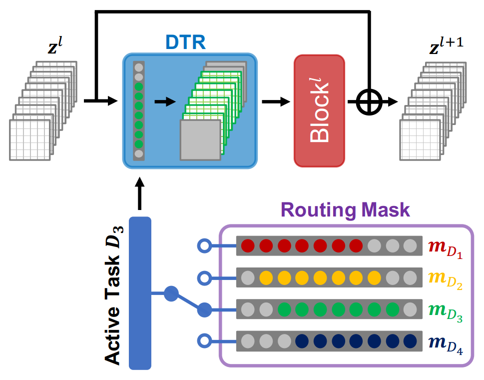
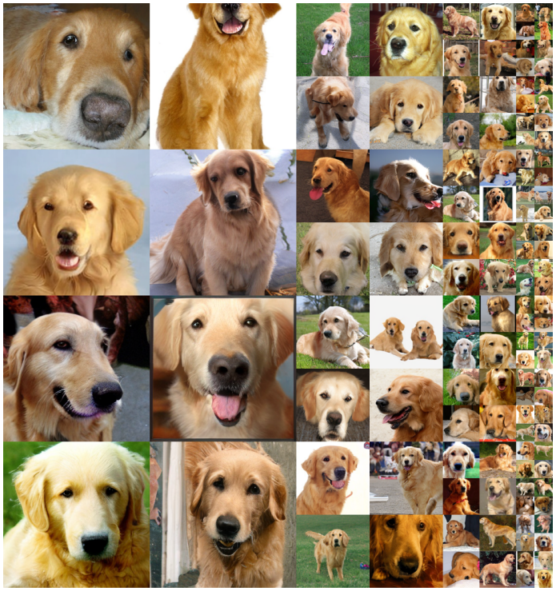
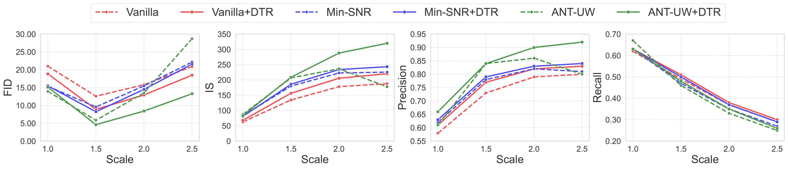

# Denoising Task Routing for Diffusion Models
<!-- Arxiv Link, Project Link -->
<a href="https://arxiv.org/abs/2310.07138"></a>
<a href="https://openreview.net/forum?id=MY0qlcFcUg"></a>
<a href="https://byeongjun-park.github.io/DTR/"></a>

This repository contains the official pytorch implementation of the paper: "Denoising Task Routing for Diffusion Models".
In this repository, we release codes for the improved version of [DiT](https://openaccess.thecvf.com/content/ICCV2023/papers/Peebles_Scalable_Diffusion_Models_with_Transformers_ICCV_2023_paper.pdf) with the task routing. 
To gain a better understanding of MTL perspective in diffusion modes, please visit the project page of [ANT](https://gohyojun15.github.io/ANT_diffusion/). 


<!-- Please Insert generated Images. -->


**DTR** creates different pathways for each denoising task (step).

**DTR** is:

💡 **Simple yet Effective** (Performance gain is significant!)

💡 **Boosts convergence speed**

💡 **No additional parameters**

💡 **Plug-and-Play** (Easily integrates into any diffusion architecture)

💡 **Minimal Code** (Implemented with just 10+ lines of code)

----------------



Generated sample (*golden retriever*) from **256x256 DiT-L/2 + DTR (w/ cfg=2.0)**.

----------------


## Updates

 * **2023.12.26**: Initial Release.

## Todo
- [ ] Project Pages

[//]: # (- [ ] Linking Addressing Negative Transfer Project Pages.)
[//]: # (- [ ] Generated Images.)
[//]: # (- [ ] Loss weighting check.)
[//]: # (- [ ] Code Cleaning.)
[//]: # (- [ ] Task Mask initialization test. )


## Setup
<a href="https://pytorch.org/get-started/locally/"></a>
<a href="https://hydra.cc/"></a>

We use 8 80GB A100 GPUs for all experiments. 
```
python3 -m pip install -r requirements.txt
```

## Training DiT with DTR

We provide an example training script for ImageNet.
 
```
torchrun --nnodes=1 --nproc_per_node=8 train.py general.data_path='<PATH_TO_DATASET>'
```

You can also modify the DiT model, optimization type, sharing ratio, etc.

```
torchrun --nnodes=1 --nproc_per_node=8 train.py \
general.data_path='<PATH_TO_DATASET>' \
general.loss_weight_type="uw" \
models.name="DiT-L/2" \
models.routing.sharing_ratio=0.8
```

## Sampling DiT with DTR
After training, the checkpoint and log files are saved based on the configuration.
Consequently, you need to execute the sampling script using the same configuration as the training script. 
Additionally, you can adjust the number of sampling images and the classifier-guidance scale.

```
torchrun --nnodes=1 --nproc_per_node=8 sample_ddp.py \
general.loss_weight_type="uw \
models.name="DiT-L/2" \
models.routing.sharing_ratio=0.8 \
eval.cfg_scale=1.5 \
eval.num_fid_samples=50000
```

Please refer to the [example scripts](https://github.com/byeongjun-park/DTR/tree/main/example_script.sh) for detailed instructions how to reproduce our results.
In this script, we enumerate the configurations that can be modified if needed.

## Results

With DiT-L/2, our DTR is compatible with MTL optimization techniques specifically designed for diffusion models.


**Quantitative Results (guidance scale = 1.5)**

| Optimization (+ DTR) | FID-50K  | Inception Score | Precision |  Recall  |
|:---------------------|:--------:|:---------------:|:---------:|:--------:|
| Vanilla              |  12.59   |     134.60      |   0.73    |   0.49   |
| Vanilla + DTR        |   8.90   |     156.48      |   0.77    | **0.51** |
| Min-SNR              |   9.58   |     179.98      |   0.78    |   0.47   |
| Min-SNR + DTR        |   8.24   |     186.02      |   0.79    |   0.50   |
| ANT-UW               |   5.85   |     206.68      | **0.84**  |   0.46   |
| ANT-UW + DTR         | **4.61** |   **208.76**    | **0.84**  |   0.48   |


**Results w.r.t. guidance scale**





## BibTeX

```bibtex
@article{park2023denoising,
  title={Denoising Task Routing for Diffusion Models},
  author={Park, Byeongjun and Woo, Sangmin and Go, Hyojun and Kim, Jin-Young and Kim, Changick},
  journal={arXiv preprint arXiv:2310.07138},
  year={2023}
}
```

## Acknowledgments
This codebase borrows from most notably [DIT](https://github.com/facebookresearch/DiT) and [ANT](https://github.com/gohyojun15/ANT_diffusion).
